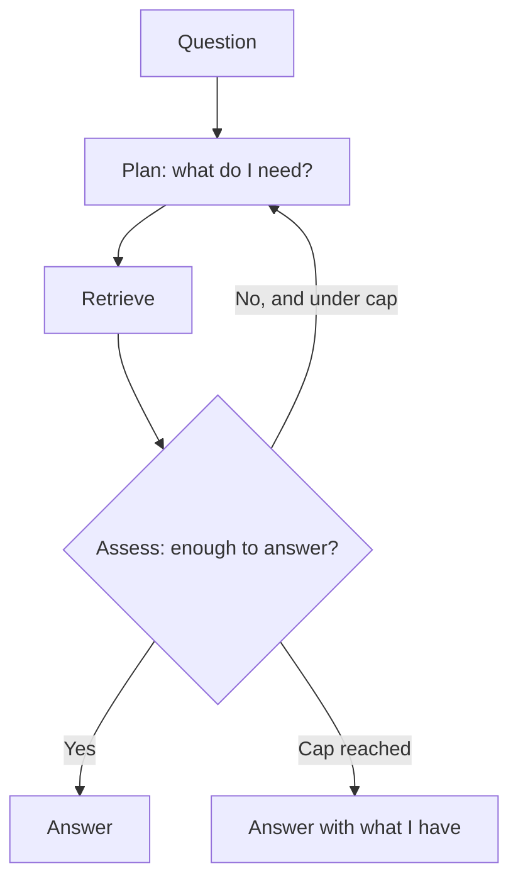

## What it is

Agentic RAG hands control of retrieval to the model. Instead of a fixed pipeline, an agent
plans, retrieves, assesses what it got, and decides whether to continue — looping until it
judges the question answered or a cap stops it.

## The problem it solves

Every technique so far has a control flow *you* wrote. Multi-Pass loops a fixed number of
times; Auto RAG picks from a fixed menu. Both assume you know in advance what shape of work
the question needs.

For open-ended questions you do not. "How did Google's storage systems influence the open
source ecosystem?" might need one retrieval or seven, and no fixed pipeline gets that right
for every query.

Agentic RAG makes the number and kind of retrievals a runtime decision.

## How it works

The difference from Multi-Pass is *who decides*. Multi-Pass always runs its
draft-critique-revise cycle. The agent chooses each step, and can stop after one retrieval
if that was enough.

## Stopping criteria are the whole design

An agent loop with no stopping criterion is not an architecture, it is an outage. Three
layers, and you need all three:

**1. Hard iteration cap.** Maximum 4 here. Non-negotiable and enforced in code, not
prompted. A prompt asking the model to stop is a request; a counter is a guarantee.

**2. Progress detection.** If iteration 3 retrieves the same chunks as iteration 2, the
agent is circling. Repeating retrieval without new information means stop, regardless of
what the assess step claims.

**3. Budget cap.** On a paid backend, a token budget that terminates the loop independent
of what the model wants. This is the layer that matters when the other two have a bug.

The steps trace exposes the agent's reasoning at each iteration precisely because these
loops are otherwise opaque — when an agent burns four iterations and answers badly, you
need to see which step went wrong.

## Trade-offs

| | Multi-Pass RAG | Agentic RAG |
|---|---|---|
| Who controls flow | You | The model |
| LLM calls | 2–6 | 2–12 |
| Latency | 3–5x | 4–15x, unpredictable |
| Cost predictability | Bounded | Bounded only by caps |
| Adapts to question | No | Yes |
| Debuggability | Straightforward | Requires trace inspection |

Note the *unpredictability* row. Multi-Pass costs roughly the same every time. Agentic RAG
varies per query, which makes capacity planning and cost forecasting genuinely harder.

## The failure mode

**Confident termination with an incomplete answer.** The agent decides it has enough,
stops, and answers. The assess step is the same model that failed to retrieve the missing
fact — it has no independent way to know what it never saw.

This is worse than Multi-Pass's version of the same problem, because the agent's stopping
decision *looks* like judgment. A trace showing "assessed: sufficient context" reads as
diligence, but it is the model agreeing with itself.

## When to use it

- Genuinely open-ended research questions where the work required varies widely
- Tool-rich environments where retrieval is one option among several
- Latency budgets measured in tens of seconds, not milliseconds
- You have trace inspection in place — this is not debuggable without it

## When NOT to use it

- **Anything user-facing and synchronous** — unpredictable multi-second latency
- **Fixed-shape questions** — if the work is always the same, write that pipeline. The
  agent adds cost and variance for no adaptivity you use.
- **Tight budgets** — an uncapped agent loop on a paid model is the single fastest way to
  burn credit in this entire project
- **Without a hard cap in code** — a prompt is not a stopping criterion

## Real-world

This is the architecture behind most "AI research assistant" products. The engineering
reality is that the interesting work is rarely the agent loop itself — it is the caps,
the progress detection, the trace tooling, and the cost controls around it.
