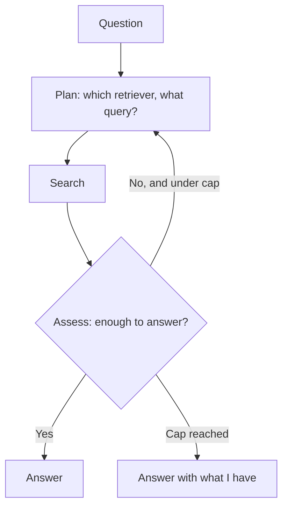

## What it is

Agentic RAG hands control of retrieval to the model. Instead of a fixed pipeline, an agent
plans a search, runs it, assesses what came back, and decides whether to go again — looping
until it judges the question answered or a cap stops it.

## The problem it solves

Every technique so far has a control flow *you* wrote. Multi-Pass always runs the same
draft-critique-retrieve-redraft cycle. Auto RAG picks one strategy, once, before it has seen a
single passage. Both assume you know in advance what shape of work the question needs.

For open-ended questions you do not. One question needs a single lookup; the next needs a rare
identifier found first and then a concept searched around it. Agentic RAG makes the number *and
the kind* of retrievals a runtime decision.

## How it works

The assess step and the next plan are **one LLM call**, not two. An assessment's only consumer
is the plan that follows it, so splitting them buys a verdict that immediately has to be fed
back in as input. One call per iteration, plus one answer at the end.

## What actually distinguishes it from Multi-Pass

Not the loop — Multi-Pass has one of those. Two things:

**The agent chooses the retriever.** Every Multi-Pass retrieval is dense; the only thing its
critique controls is the text being embedded. The planner here picks `vector`, `keyword`, or
`hybrid` *and* writes the query, with the evidence gathered so far in front of it. That is Auto
RAG's routing decision, made repeatedly and informed rather than once and blind.

**There is no draft.** Multi-Pass writes a full answer every pass and then pays a second call to
critique it. This plans first and generates once, at the end. Three iterations here cost 4 LLM
calls; Multi-Pass's three passes cost 5.

Planning before drafting also sidesteps the trap that made Multi-Pass's first critique prompt a
no-op. That prompt asked whether the *draft* answered the question — and a draft saying "the
passages do not mention Spanner" answers it perfectly, so the critique approved everything. With
no draft in existence there is nothing to grade except the passages.

## Stopping criteria are the whole design

An agent loop with no stopping criterion is not an architecture, it is an outage. Four
conditions stop this one, and only the first is a guarantee:

**1. A hard iteration cap** — `settings.agentic_max_iterations`, set to 3, living in config
beside the spend guardrails rather than inside the pipeline. Everything below is best-effort;
only a counter cannot be talked out of stopping by a confused model.

**2. The agent says ANSWER** — it believes the evidence covers the question. This is the
criterion that fires almost every time, and the section below is about how little it is worth.

**3. A repeated action** — the planner asked for a search it already ran. An agent that chooses
its own next action can choose the same one forever, and this is the failure the other criteria
do not name. Strategy is part of the comparison, so switching from dense to BM25 on the same
words is allowed: that is the one repeat worth paying for.

**4. No new evidence** — a genuinely new search returned only chunks already in hand. The corpus
is out of material; more planning cannot conjure any.

(3) and (4) look alike and diagnose opposite problems: (3) is a bad planner, (4) is a thin
corpus. `termination_reason` reports which fired, so the compare view can tell them apart.

**What is deliberately *not* here:** a token budget that ends the loop mid-flight. The spend caps
live one layer down in the LLM client — a per-call output cap and a per-session paid-call cap —
where they protect every technique instead of just this one. With iterations capped at 3, the
worst case is already a fixed number of calls, so a second budget inside the loop would be a
guarantee bought twice.

## Measured on this corpus: the loop barely runs

This site is not going to show you the diagram and stop. Fourteen live runs on the local
`qwen3:8b`, across four question shapes:

| | observed |
|---|---|
| Runs that stopped after exactly **one** search | **11 of 14** |
| Runs where the assess step *chose* to search again | **1 of 14** |
| Runs that continued only because the plan was unreadable | 2 of 14 |
| Runs that hit the iteration cap | 1 of 14 |
| Planner replies that came back **empty** | 7 of 51 calls (14%) |

So the technique's defining feature — a loop whose length the model decides — fires once in
fourteen runs, and twice as often the loop continues by accident. What is left when it does not
fire is Auto RAG with a slower router and one extra call that says `ANSWER`.

### The assess step is the weak component, measured directly

Held constant at the hardest state available on this corpus — a two-part question where the
retrieved passages answer the first part and contain nothing about the second:

| planner setting | verdict |
|---|---|
| thinking **off** | `ANSWER` **3/3**, in 3 output tokens and 0.1s |
| thinking **on** | never named the real gap in 6 samples — 1 `ANSWER`, 2 searches for material it already had, 3 empty replies |
| thinking on, with the "check each part separately" instruction | named the real gap **1 of 3** |

Thinking off makes the assessor a no-op that agrees with everything — exactly what Phase 6
measured for Multi-Pass's critique, reproduced in a different prompt on a different task. It is
therefore on, which costs 8–27 seconds per iteration.

On the same evidence, asked to assess a question it *does* cover, both variants correctly reply
`ANSWER` 3/3. The assessor is not indiscriminate. It is specifically bad at noticing an absence.

**Why, and it is not stupidity.** The question is *"what replaced ZooKeeper in newer Kafka, and
what was that protocol designed to be easier than?"* The retrieved `kafka.md#4` says KRaft's
motivation was "removing a second distributed system from every deployment." That reads like an
answer to "easier than what." The real answer — Raft was published as an understandable
alternative to **Paxos** — lives in `raft.md#1`, which nothing retrieves. The assess step cannot
detect a gap that the evidence plausibly appears to fill, because detecting it requires knowing
the fact that is missing.

That is the general shape of the failure, and it gets worse with more iterations rather than
better: an agent loop compounds a bad judge.

### Against the baseline, it loses

Same question, same model, same index:

| | Standard RAG | Multi-Pass RAG | Agentic RAG |
|---|---|---|---|
| Latency | **7.3s** | 30.4s | 32–73s |
| LLM calls | **1** | 2 | 3–4 |
| Retrieval passes | 1 | 1 | 1 (3 once) |
| Second hop | wrong | wrong | **wrong, identically** |

Every technique on this page produces the same wrong sentence: *"Raft was designed to be easier
than ZooKeeper."* Agentic RAG pays between 4x and 10x the latency to be wrong in the same way,
including on the run where the loop did fire and gathered five chunks instead of four.

On a plain single-hop question (*"how does Dynamo handle conflicting concurrent writes?"*) the
answers are substantively identical: 6.3s for Standard, 27–29s for Agentic.

**One thing planning genuinely does buy.** The agent's rewritten queries retrieve chunks the raw
question would not: in **8 of 14 runs** at least one chunk was outside dense top-4 on the
original wording, and the trace names them on every run. The retrieval changes. It just never
changed for the better here — which is the honest version of "the agent adapts."

**Two of the four stopping criteria have never fired against the real index.** `agent_stopped`
(11 runs), `max_iterations` (1) and `no_new_evidence` (1) have all been observed live;
`repeated_action` and `empty_index` are unit-tested but have not happened for real. Worth knowing
before treating the repeat guard as proven rather than merely correct.

**The lesson is about corpus size and model size, not about agents.** Nine documents are small
enough that the first search usually holds whatever the corpus has, so there is nothing for a
second iteration to find and the assessor is right to stop more often than it is wrong. And an
8B local model is not a reliable judge of absence. Agentic retrieval earns its latency when the
corpus is large enough that one search genuinely misses, and when the judge is good enough to
notice. Neither holds here.

## Trade-offs

| | Multi-Pass RAG | Agentic RAG |
|---|---|---|
| Who controls flow | You | The model |
| Retriever choice | Always dense | **The model's, per search** |
| LLM calls | 2–5 | 3–4 |
| Latency (measured) | ~4x Standard | 4–10x Standard |
| Cost predictability | Bounded | Bounded, but the bound is loose |
| Debuggability | Straightforward | Requires trace inspection |

Note the *unpredictability* row. Multi-Pass costs roughly the same every time. Agentic RAG
ranged from 27s to 73s on the same corpus, which makes capacity planning and cost forecasting
genuinely harder — and the variance came from the model's sampling, not from the questions.

## The failure mode

**Confident termination with an incomplete answer** — and it is the common case here, not the
edge case. The agent decides it has enough, stops, and answers. The assess step is the same model
that failed to retrieve the missing fact; it has no independent way to know what it never saw.

This is worse than Multi-Pass's version of the same problem, because the stopping decision *looks*
like judgment. A trace reading `ANSWER — evidence is sufficient` reads as diligence. It is the
model agreeing with itself, and the run above shows it doing so on a question it got wrong.

**Second failure mode, measured at 14% of planner calls: silence.** Ollama draws thinking tokens
from the same output budget as the reply, so a planner that thinks hard can exhaust the budget
before writing its one line. An empty reply is not a decision, and treating it as one would let
the loop stop for a reason nobody chose. Here it falls back to dense retrieval on the original
question — degrading to the Standard RAG baseline rather than to nothing — and the trace says
`UNREADABLE PLAN` so it can never be mistaken for a real plan.

## When to use it

- Corpora large enough that the first search genuinely misses things
- Genuinely open-ended research questions where the work required varies widely
- Tool-rich environments where retrieval is one option among several — the value is in choosing
  *which tool*, which is the part that survived measurement here
- A model strong enough to judge absence, which an 8B local model is not
- Latency budgets measured in tens of seconds, and trace inspection already in place

## When NOT to use it

- **Anything user-facing and synchronous** — unpredictable multi-second latency
- **Small corpora** — if one search usually holds everything, the loop has nothing to do and you
  pay for a judge that only ever agrees
- **Fixed-shape questions** — if the work is always the same, write that pipeline
- **Tight budgets** — an uncapped agent loop on a paid model is the fastest way to burn credit in
  this entire project
- **Without a hard cap in code** — a prompt is not a stopping criterion

## Real-world

This is the architecture behind most "AI research assistant" products. The engineering reality is
that the interesting work is rarely the agent loop itself — it is the caps, the repeat detection,
the trace tooling, and the cost controls around it. The loop is twenty lines. Everything that
makes it safe to run is the rest.
