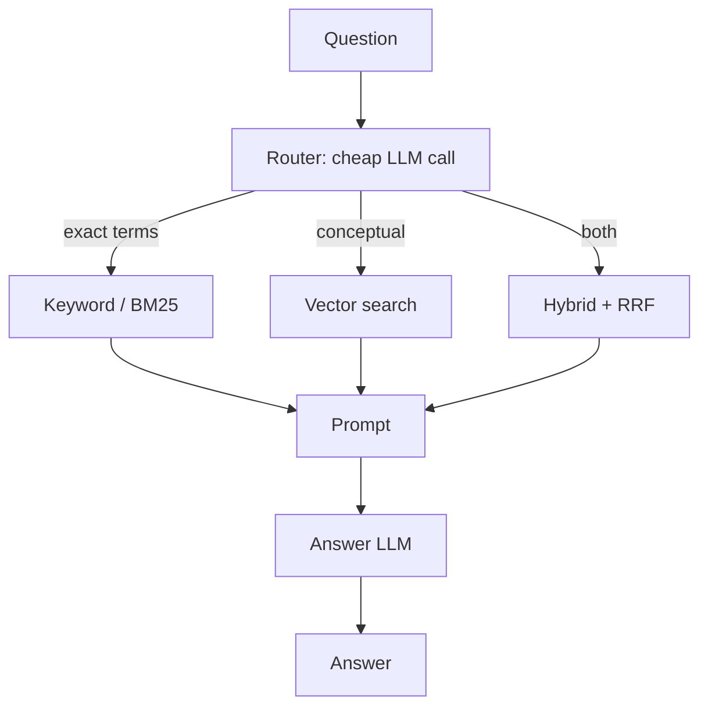

## What it is

Auto RAG puts a cheap classifier in front of the expensive work. A small model reads the
query, picks a retrieval strategy — vector, keyword, or hybrid — and only then does the
pipeline run.

## The problem it solves

The previous techniques apply one strategy to every query. But queries are not alike:

- `"reversed hostnames"` — a rare literal phrase. Measured on this corpus, BM25 returns
  four chunks of `bigtable.md` and dense returns **none**. Keyword search wins.
- `"How does Dynamo stay available during partitions?"` — conceptual, no distinctive
  tokens. Vector search wins.
- `"Explain the CAP trade-off in Dynamo vs Raft"` — both, plus breadth. Hybrid wins.

Always running hybrid works but pays for two retrievers on every query. Always running one
retriever is wrong for a predictable slice of traffic. Auto RAG spends a small amount to
decide, then spends the right amount.

## How it works

The router is a classification call, not a generation call — it emits one label. That is
why it can use a small model and a tight output cap (256 tokens on the paid backend, versus
512 for the answer; 1024 locally, sized for the *other* helper calls that need to think).
Thinking is switched off for the router specifically: measured on this machine, the same
prompt takes 0.07–0.23 s without it and 11.1–34.2 s with it, a 55×–190× difference for the
same one-word verdict.

## The router pattern

This is a general architecture, not a RAG idea. A cheap model triages; expensive workers
handle only what needs them. It appears in support-ticket routing, query planners, and
model-cascade systems.

The economics only work when **routing is much cheaper than the work being routed.** A
router costing 30% of the answer call cannot save enough to justify itself. Here the
router sees only the query — tens of tokens — while the answer call sees four retrieved
passages, around a thousand. That ratio is what makes it viable.

## Trade-offs

| | Standard RAG | Fusion RAG | Auto RAG |
|---|---|---|---|
| LLM calls | 1 | 1 | 2 (router + answer) |
| Retrievers run | 1 | 2 always | 1 or 2, per query |
| Added latency | — | tiny | one extra round trip |
| Adapts to query type | No | Partly | Yes |
| New failure mode | — | — | Router picks wrong |

## The failure mode

**A misrouted query fails silently and looks like a retrieval problem.** Send an exact-term
query down the vector path and you get Standard RAG's exact-term weakness back, with nothing
in the answer to indicate that a routing decision caused it.

That is not hypothetical here. Measured on `reversed hostnames`, the local 8B router picks
`vector` on every run — and dense retrieval returns `dynamo.md#3`, `raft.md#2`, `raft.md#3`,
`chubby.md#2`: **zero** chunks of `bigtable.md`, the only document that contains the phrase.
BM25 would have returned four out of four. The router's own prompt describes this query
almost word for word under `keyword` ("a rare, literal, technical term"), and the model
routes it elsewhere anyway. **The pattern is sound; a small classifier is the part that
fails**, and it fails on a corpus rigged to make the right answer obvious.

This is why the router's choice belongs in the steps trace. Without it, debugging a bad
answer means guessing which of two subsystems misbehaved.

There is a second, subtler cost: **the router is another component that can drift.** A
prompt tuned for one model's classification behaviour may route differently on another,
and that change is invisible until you inspect traces.

## When to use it

- Genuinely mixed query traffic — some exact-term, some conceptual
- Enough volume that always-hybrid costs real money
- You can measure routing accuracy; otherwise you are adding a component you cannot debug

## When NOT to use it

- **Homogeneous queries** — if 90% of traffic is one type, just use that strategy. The
  router is pure overhead.
- **Latency-critical paths** — an extra round trip before retrieval even starts
- **Small deployments** — always-hybrid is simpler and the saving is negligible

## Real-world

Every production system with more than one retrieval path ends up with something like
this, even if it starts as a regex. The interesting design question is usually not *should
we route* but *should the router be a model at all* — a hand-written rule ("query contains
a quoted string or an identifier → keyword") is often accurate enough, free, and fully
debuggable.
