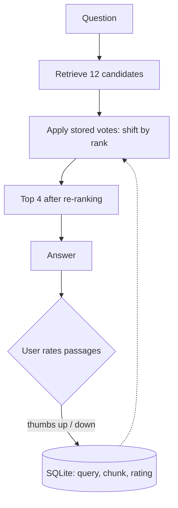

## What it is

Feedback-Based RAG persists user judgments. A thumbs up or down on a retrieved passage is
stored, and future retrievals boost or demote that passage. In this lab the vote is *global*:
it is keyed to the passage itself, so it applies to every later question, not only to similar
ones. That is the simplest thing that works, and the section on naive boosting is what it costs.

Interactive RAG asks the user and forgets. This one remembers.

## The problem it solves

Relevance is not a property of a passage — it is a property of a passage *for a query, for
an audience*. An embedding model cannot know that your team always means the internal
deploy tool when they say "the pipeline", not the CI one.

That knowledge exists only in usage. Feedback RAG is the mechanism for capturing it
without retraining anything.

## How it works



The dotted line is the loop: today's feedback changes tomorrow's ranking. The obvious scoring
rule adds a weight to the similarity score, and it is the Fusion RAG mistake again: similarity
lives on a different scale for every query. Measured on this corpus, the twelve candidates for
"What is hinted handoff?" score 0.136-0.256, while those for "How does Dynamo handle conflicting
concurrent writes?" score 0.452-0.762 — one fixed weight would decide the first ranking outright
and do nothing to the second. Ranks are comparable across queries; scores are not. So a vote buys
*places*, not points:

```
position  = dense_rank − SHIFT · clamp(net_votes, −CAP, +CAP)     # SHIFT = 2, CAP = 3
re-ranked = sort by (position, dense_rank), then keep the top 4
```

`SHIFT` controls how much feedback can override the retriever. It is the most consequential
number in the system: at 2, three net votes move a passage five places, which is enough to evict
the retriever's own first choice. (Six is the shift applied to the sort key; the passage it lands
level with keeps the tie, so it gains one place less than that.)

## Why naive boosting is dangerous

This is the technique with the most interesting failure mode on the site, and it is a
structural one, not a bug.

**Feedback creates a self-reinforcing loop.** A passage that gets boosted appears higher →
is seen more → collects more ratings → gets boosted further. A passage that never surfaces
is never rated, so it can never recover. The system converges on a small set of
"popular" passages and slowly stops being a retriever.

This is the recommender-systems filter bubble, arriving in a RAG pipeline. The standard
mitigations apply:

- **Cap the weight.** Feedback should nudge ranking, not dominate similarity. This lab caps the
  net votes per passage (`CAP = 3`) but deliberately sets `SHIFT` high enough that three votes
  *do* dominate — the retriever's top passage can be voted out of the answer. That is a demo
  setting, chosen so the failure is a few clicks away instead of a few thousand; a real system
  picks a shift small enough that feedback only breaks ties.
- **Decay old feedback.** A rating from six months ago describes a corpus that may have
  changed.
- **Reserve exploration slots.** Keep one or two unboosted results in every top-k so
  unrated passages get a chance to be seen.
- **Normalise by exposure.** Ten downvotes out of a thousand impressions is not the same
  signal as ten out of twelve.

Without exploration in particular, the system is not learning — it is calcifying.

## Trade-offs

| | Standard RAG | Feedback RAG |
|---|---|---|
| Personalisation | None | Improves with use |
| Cold start | Works immediately | No signal until feedback accumulates |
| Storage | Vector index | Vector index + feedback store |
| Failure mode | Wrong passage | Filter bubble, silently |
| Debuggability | Deterministic | Ranking depends on history |

That last row is a real operational cost: the same query can return different passages
this week than last, and reproducing a past result means reconstructing the feedback state
at that time.

## When to use it

- Long-lived deployments with a stable, repeat user base
- Domains with vocabulary the embedding model cannot know — internal jargon, product names
- Enough query volume for feedback to accumulate meaningfully
- You are willing to monitor for bubble formation

## When NOT to use it

- **Low-traffic systems** — never enough feedback to matter, all cost and no benefit
- **One-shot users** — no repeat queries to improve
- **Rapidly changing corpora** — feedback ages badly against documents that have been
  rewritten
- **Without exploration and decay** — you are building a bubble, not a learning system
- **When you cannot measure whether it helped** — a ranking that changes over time and is
  not measured is a ranking you no longer understand

## Real-world

Every search product does a version of this via click-through data, and every one of them
has an exploration strategy to counteract the bubble — that part is not optional at scale.
The RAG-specific twist is that the "click" is an explicit rating on a passage rather than
an inferred signal from behaviour, which makes it sparser but much less noisy.
