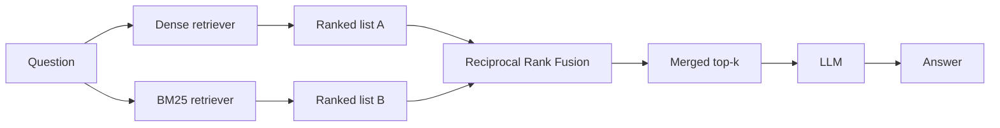

## What it is

Fusion RAG runs two retrievers with opposite strengths — dense vector search and keyword
search (BM25) — and merges their rankings. It exists because those two blind spots do not
overlap.

## The problem it solves

Dense retrieval matches on *meaning*. That is its strength and precisely its weakness: it
blurs exact tokens.

Three measured examples from this project's own corpus. In each, the query is a rare exact
term, and dense retrieval returns **the wrong document entirely**:

| Query | Answer lives in | Dense top hit | BM25 top hit |
|---|---|---|---|
| `hinted handoff` | `dynamo.md` | `raft.md` ✗ | `dynamo.md` ✓ |
| `Chubby` | `bigtable.md` | `mapreduce.md` ✗ | `bigtable.md` ✓ |
| `reversed hostnames` | `bigtable.md` | `dynamo.md` ✗ | `bigtable.md` ✓ |

Why this happens: each query is one or two load-bearing tokens with little surrounding
context. Embedded into 384 dimensions, `hinted handoff` lands somewhere in the region of
"distributed systems failure handling" — which is genuinely close to Raft's discussion of
leader failure. The embedding is not wrong about the *topic*. It simply has no way to
represent "this exact phrase appears in this exact chunk", and that is the whole of what
the query was asking.

BM25 has the exact opposite profile. It nails all three, and would completely miss the
vector-clocks question that dense retrieval answers easily — that query shares almost no
vocabulary with the passage that answers it.

## How it works



This is a scatter-gather: fan out to independent retrievers, then combine. The retrievers
do not know about each other and can run in parallel.

## Why merge by rank, not by score

The obvious approach — average the two scores — is wrong, and the reason is worth
internalising.

Cosine similarity runs roughly 0 to 1 and clusters tightly; BM25 is unbounded and depends
on corpus statistics. A BM25 score of 12 and a cosine score of 0.7 are not comparable
quantities. Averaging them lets whichever scale happens to be larger dominate, which is an
artefact of the scoring functions, not a statement about relevance.

**Ranks are comparable. Scores are not.** Reciprocal Rank Fusion uses only position:

```
RRF(d) = Σ  1 / (k + rank_i(d))
```

summed over each retriever that returned document `d`, with `k` a constant (commonly 60)
that damps the influence of the very top ranks so one retriever cannot unilaterally decide
the result.

A document ranked #1 by both retrievers scores highest. A document ranked #1 by one and
absent from the other still places well — which is what lets fusion surface something the
other retriever missed entirely.

**Complexity:** O(n log n) per retriever for the sort, O(n) for the merge.

## Where RRF itself fails

Summing reciprocal ranks means **a document found by both retrievers beats a document found
by only one — always, at any `k`.** That is usually the behaviour you want, and sometimes
it is exactly wrong.

Measured here, on `reversed hostnames`:

- BM25 ranks the correct chunk (`bigtable.md#0`) **#1**, and dense does not return it at all
- Dense ranks `dynamo.md#3` **#1**; BM25 also has it, down at **#8**
- Fused: `dynamo.md#3` wins, and the correct chunk loses

The arithmetic is unavoidable:

```
dynamo.md#3    = 1/(k+1) + 1/(k+8)     found by both
bigtable.md#0  = 1/(k+1)               found by one
```

The second term is always positive, so no choice of `k` rescues the correct answer.
Sweeping `k` from 1 to 200 changes nothing.

**The lesson: RRF rewards consensus over conviction.** When one retriever is authoritative
for a *kind* of query — BM25 for rare exact terms — plain unweighted fusion dilutes it with
the other retriever's confident wrongness. Production systems handle this by weighting
retrievers per query type, which is the point at which fusion starts to need the router
from Auto RAG.

## Trade-offs

| | Standard RAG | Fusion RAG |
|---|---|---|
| Retrievers | 1 | 2 (parallel) |
| LLM calls | 1 | 1 |
| Added latency | — | Small — retrieval is ~1% of wall clock |
| Index cost | Vector index | Vector index + term index |
| Exact-term queries | Weak | Strong |
| Paraphrased queries | Strong | Strong |

The latency point matters: retrieval is a tiny fraction of total time compared to
generation, so adding a second retriever costs almost nothing end to end.

## Fusion is not strictly better

Precision@1 measured over eight queries against this corpus:

| | dense | BM25 | fused |
|---|---|---|---|
| correct top hit | 4/8 | **8/8** | 7/8 |

Fusion nearly doubles dense retrieval — and loses to BM25 alone.

The caveat matters: several of those queries were chosen to find divergence, so the set
leans toward rare exact terms, which is BM25's home ground. A set of paraphrased questions
would invert the result. **Fusion buys robustness across query types, not peak precision on
any one type.** If you know your traffic is all exact-term lookups, ship BM25 and skip the
vector index entirely.

## When to use it

- Corpora with identifiers, error codes, proper nouns, API names
- Mixed query styles — some users paste exact strings, others ask in prose
- Effectively a default upgrade over Standard RAG when you can afford a second index

## When NOT to use it

- **Purely conceptual corpora** with no distinctive vocabulary — BM25 adds little
- **Storage-constrained deployments** — you now maintain two indexes over the same corpus
- **When the real problem is multi-hop** — fusion improves *what* is retrieved in one pass,
  not the number of passes. Two retrievers still cannot chain facts across documents.

## Real-world

RRF is the standard hybrid-search primitive: Elasticsearch, OpenSearch, Vespa, and most
managed vector databases ship it. It is popular because it is nearly free, needs no
training, and has no parameters to tune beyond `k`.
