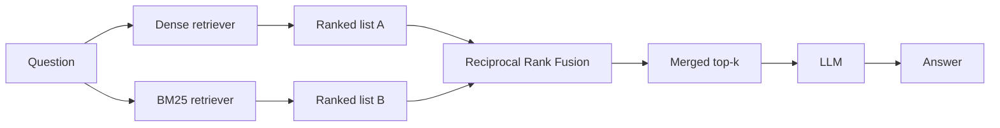

## What it is

Fusion RAG runs two retrievers with opposite strengths — dense vector search and keyword
search (BM25) — and merges their rankings. It exists because those two blind spots do not
overlap.

## The problem it solves

Dense retrieval matches on *meaning*. That is its strength and precisely its weakness: it
blurs exact tokens.

Three measured examples from this project's own corpus. In each, the query is a rare exact
term, and dense retrieval returns **the wrong document entirely**:

| Query | Answer lives in | Dense top hit | BM25 top hit |
|---|---|---|---|
| `hinted handoff` | `dynamo.md`, `cassandra.md` | `raft.md#0` ✗ | `cassandra.md#4` ✓ |
| `commit wait` | `spanner.md` | `chubby.md#2` ✗ | `spanner.md#4` ✓ |
| `reversed hostnames` | `bigtable.md` | `dynamo.md#3` ✗ | `bigtable.md#0` ✓ |

(`cassandra.md#4` is a correct hit: Cassandra inherits hinted handoff from Dynamo and names
it as such.)

Why this happens: each query is one or two load-bearing tokens with little surrounding
context. Embedded into 384 dimensions, `hinted handoff` lands somewhere in the region of
"distributed systems failure handling" — which is genuinely close to Raft's discussion of
leader failure. The embedding is not wrong about the *topic*. It simply has no way to
represent "this exact phrase appears in this exact chunk", and that is the whole of what
the query was asking.

BM25 has the exact opposite profile. It nails all three, and misses the questions whose
wording shares no vocabulary with the passage that answers them. Measured: `How is a large
file split up for storage?` returns `gfs.md#1` from dense — the chunk that says files are
divided into fixed-size 64 MB *chunks* — and `bigtable.md#1` from BM25, which is about
column families. The question says "split up"; the answer says "chunk". Term overlap has
nothing to work with, and meaning is all that is left.

## How it works



This is a scatter-gather: fan out to independent retrievers, then combine. The retrievers
do not know about each other and can run in parallel.

## Why merge by rank, not by score

The obvious approach — average the two scores — is wrong, and the reason is worth
internalising.

Cosine similarity runs roughly 0 to 1 and clusters tightly; BM25 is unbounded and depends
on corpus statistics. A BM25 score of 12 and a cosine score of 0.7 are not comparable
quantities. Averaging them lets whichever scale happens to be larger dominate, which is an
artefact of the scoring functions, not a statement about relevance.

**Ranks are comparable. Scores are not.** Reciprocal Rank Fusion uses only position:

```
RRF(d) = Σ  1 / (k + rank_i(d))
```

summed over each retriever that returned document `d`, with `k` a constant (commonly 60)
that damps the influence of the very top ranks so one retriever cannot unilaterally decide
the result.

A document ranked #1 by both retrievers scores highest. A document ranked #1 by one and
absent from the other still places well — which is what lets fusion surface something the
other retriever missed entirely.

**Complexity:** O(n log n) per retriever for the sort, O(n) for the merge.

## Where RRF itself fails

Summing reciprocal ranks means **agreement is worth more than confidence.** That is usually
the behaviour you want, and sometimes it is exactly wrong.

Measured here, on `reversed hostnames`:

- BM25 ranks the correct chunk (`bigtable.md#0`) **#1**, and dense does not return it at all
- `cassandra.md#0` is merely **#5** in *both* lists — mediocre twice over
- Fused: `cassandra.md#0` wins, and the correct chunk drops out of the top 4 entirely

The arithmetic:

```
cassandra.md#0 = 1/(k+5) + 1/(k+5)     found by both, unimpressively
bigtable.md#0  = 1/(k+1)               found by one, decisively
```

Two fifth places beat one first place whenever `2/(k+5) > 1/(k+1)`, i.e. whenever `k > 3`.

**But that inequality is not the one that decides the outcome, and mistaking it for such is
easy.** It settles only the *pairwise* order of those two chunks. What the pipeline actually
consumes is top-4 *membership*, and membership is decided by whoever is standing in fourth
place. Sweeping `k` over the real candidate lists (12 per retriever) shows the difference:

```
k = 0…3   bigtable.md#0 in the fused top 4, ranked above cassandra.md#0
k = 4…6   bigtable.md#0 still in the top 4, now ranked below cassandra.md#0
k ≥ 7     bigtable.md#0 gone
```

At `k = 4` `cassandra.md#0` overtakes the correct chunk exactly as the inequality predicts —
and nothing is lost, because the chunk is still in the window. It only falls out at `k = 7`,
when the fourth-place competitor catches it: `cassandra.md#3`, ranked **dense #9 and BM25
#8**, scoring `1/(k+9) + 1/(k+8)`. Two mediocre placements overtake one first place at
`k = 7`, not at `k = 4`. The failure is three steps further out than the arithmetic about
the *winner* suggests — because RRF's consensus bonus accrues to every chunk both retrievers
saw, not only to the one at the top.

`k` is still not free to tune. It *is* the damping that stops one retriever unilaterally
deciding the result, which is the reason the standard value is 60. Lowering it to rescue this
query trades this failure for its mirror image.

**The lesson: RRF rewards consensus over conviction.** When one retriever is authoritative
for a *kind* of query — BM25 for rare exact terms — plain unweighted fusion dilutes it with
the other retriever's confident wrongness. Production systems handle this by weighting
retrievers per query type, which is the point at which fusion starts to need the router
from Auto RAG.

## Trade-offs

| | Standard RAG | Fusion RAG |
|---|---|---|
| Retrievers | 1 | 2 (parallel) |
| LLM calls | 1 | 1 |
| Added latency | — | Small — retrieval is ~1% of wall clock |
| Index cost | Vector index | Vector index + term index |
| Exact-term queries | Weak | Strong |
| Paraphrased queries | Strong | Strong |

The latency point matters: retrieval is a tiny fraction of total time compared to
generation, so adding a second retriever costs almost nothing end to end.

## Fusion is not strictly better

Measured over eight queries against this corpus — four rare exact terms, four paraphrased
questions, each with the document that answers it recorded up front:

| Query | Answer lives in |
|---|---|
| `hinted handoff` | `dynamo.md`, `cassandra.md` |
| `reversed hostnames` | `bigtable.md` |
| `commit wait` | `spanner.md` |
| `vector clocks` | `dynamo.md` |
| `How does a leader keep followers up to date?` | `raft.md` |
| `What happens when a worker machine fails mid-job?` | `mapreduce.md` |
| `How is a large file split up for storage?` | `gfs.md` |
| `How do writes stay available when a replica is down?` | `dynamo.md`, `cassandra.md` |

| | dense | BM25 | fused |
|---|---|---|---|
| Precision@1 — right document ranked first | 3/8 | **7/8** | 3/8 |
| Recall@4 — right document anywhere in the top 4 | 5/8 | **8/8** | 7/8 |

Two things fall out of that, and the second is the one that matters.

**Fusion does not improve precision@1 here at all.** RRF reorders by consensus, and on the
exact-term queries the two retrievers disagree so completely that consensus lands on
something neither would have picked first.

**Fusion does improve recall@4, 5/8 to 7/8** — and recall@4 is the metric a RAG pipeline is
actually graded on, because all four chunks go into the prompt. The model does not care
which one was ranked first; it cares whether the answer is in the context at all.

The caveat still applies: half of these queries were chosen to find divergence, so the set
leans toward rare exact terms, which is BM25's home ground. **Fusion buys robustness across
query types, not peak precision on any one type.** If you know your traffic is all
exact-term lookups, ship BM25 and skip the vector index entirely.

## When to use it

- Corpora with identifiers, error codes, proper nouns, API names
- Mixed query styles — some users paste exact strings, others ask in prose
- Effectively a default upgrade over Standard RAG when you can afford a second index

## When NOT to use it

- **Purely conceptual corpora** with no distinctive vocabulary — BM25 adds little
- **Storage-constrained deployments** — you now maintain two indexes over the same corpus
- **When the real problem is multi-hop** — fusion improves *what* is retrieved in one pass,
  not the number of passes. Two retrievers still cannot chain facts across documents.

## Real-world

RRF is the standard hybrid-search primitive: Elasticsearch, OpenSearch, Vespa, and most
managed vector databases ship it. It is popular because it is nearly free, needs no
training, and has no parameters to tune beyond `k`.
