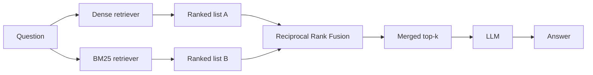

## What it is

Fusion RAG runs two retrievers with opposite strengths — dense vector search and keyword
search (BM25) — and merges their rankings. It exists because those two blind spots do not
overlap.

## The problem it solves

Dense retrieval matches on *meaning*. That is its strength and precisely its weakness: it
blurs exact tokens.

There is a real example in this project's own corpus. Query **"What is a memtable?"** and
dense retrieval returns, as its top hit, a passage about Bigtable's *tablet location
hierarchy* — not the passage that defines a memtable, which ranks third.

Why: the query has one load-bearing word. Embedded into 384 dimensions, "memtable" becomes
a point near "Bigtable storage internals" generally, and every chunk of that document sits
near that point. The signal that one specific chunk contains the literal token is averaged
away with everything else in it.

BM25 has the exact opposite profile. It would rank the memtable passage first and would
completely miss the vector-clocks question that dense retrieval answers easily.

## How it works



This is a scatter-gather: fan out to independent retrievers, then combine. The retrievers
do not know about each other and can run in parallel.

## Why merge by rank, not by score

The obvious approach — average the two scores — is wrong, and the reason is worth
internalising.

Cosine similarity runs roughly 0 to 1 and clusters tightly; BM25 is unbounded and depends
on corpus statistics. A BM25 score of 12 and a cosine score of 0.7 are not comparable
quantities. Averaging them lets whichever scale happens to be larger dominate, which is an
artefact of the scoring functions, not a statement about relevance.

**Ranks are comparable. Scores are not.** Reciprocal Rank Fusion uses only position:

```
RRF(d) = Σ  1 / (k + rank_i(d))
```

summed over each retriever that returned document `d`, with `k` a constant (commonly 60)
that damps the influence of the very top ranks so one retriever cannot unilaterally decide
the result.

A document ranked #1 by both retrievers scores highest. A document ranked #1 by one and
absent from the other still places well — which is exactly what you want, since the whole
premise is that each retriever sees things the other misses.

**Complexity:** O(n log n) per retriever for the sort, O(n) for the merge.

## Trade-offs

| | Standard RAG | Fusion RAG |
|---|---|---|
| Retrievers | 1 | 2 (parallel) |
| LLM calls | 1 | 1 |
| Added latency | — | Small — retrieval is ~1% of wall clock |
| Index cost | Vector index | Vector index + term index |
| Exact-term queries | Weak | Strong |
| Paraphrased queries | Strong | Strong |

The latency point matters: retrieval is a tiny fraction of total time compared to
generation, so adding a second retriever costs almost nothing end to end.

## When to use it

- Corpora with identifiers, error codes, proper nouns, API names
- Mixed query styles — some users paste exact strings, others ask in prose
- Effectively a default upgrade over Standard RAG when you can afford a second index

## When NOT to use it

- **Purely conceptual corpora** with no distinctive vocabulary — BM25 adds little
- **Storage-constrained deployments** — you now maintain two indexes over the same corpus
- **When the real problem is multi-hop** — fusion improves *what* is retrieved in one pass,
  not the number of passes. Two retrievers still cannot chain facts across documents.

## Real-world

RRF is the standard hybrid-search primitive: Elasticsearch, OpenSearch, Vespa, and most
managed vector databases ship it. It is popular because it is nearly free, needs no
training, and has no parameters to tune beyond `k`.
