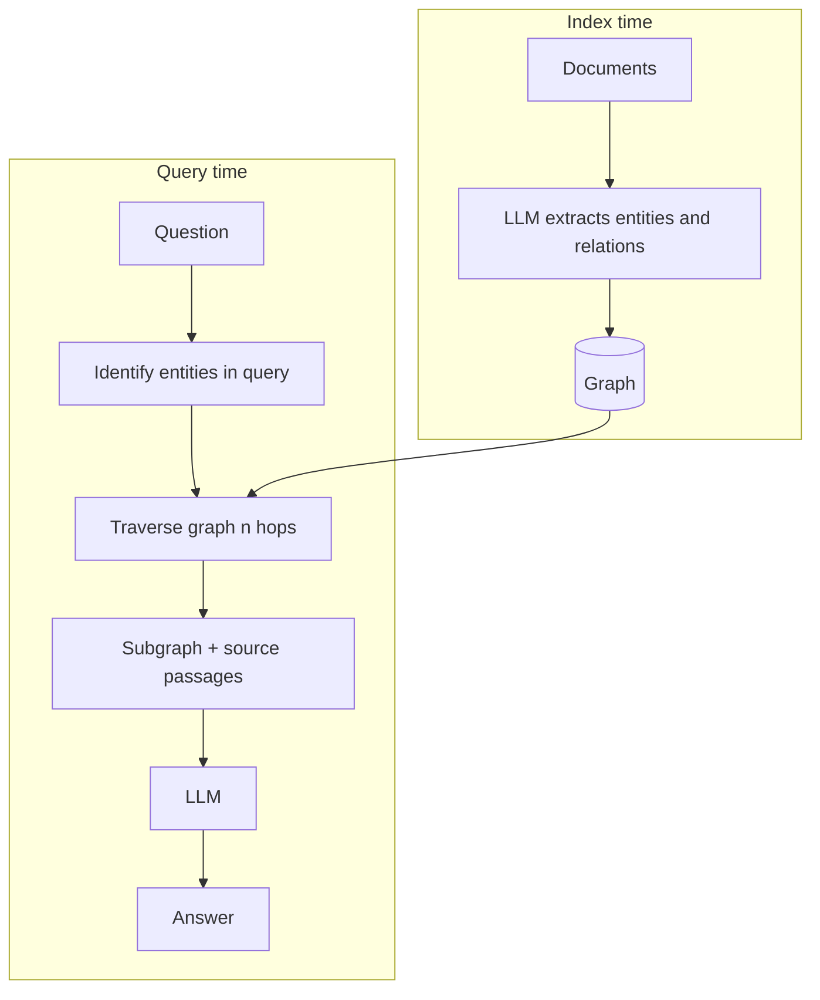
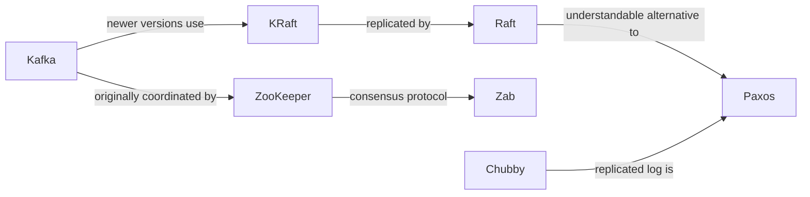

## What it is

Graph RAG extracts entities and the relationships between them at index time, builds a
graph, and retrieves by traversing it rather than by similarity alone.

## The problem it solves

Some questions have no single passage that answers them.

> *What replaced ZooKeeper in newer Kafka, and what was that protocol designed to be
> easier than?*

Answering it takes two hops through this project's 43-chunk corpus:

1. `kafka.md#4` — newer Kafka replaces ZooKeeper with **KRaft**, which moves cluster
   metadata into an internal topic replicated by **Raft**.
2. `raft.md#1` / `chubby.md#3` — Raft was published with an explicit design goal of
   understandability, as an alternative to **Paxos**.

The hops do not overlap, and that is measurable rather than asserted. `KRaft` occurs in
exactly **one** chunk of 43 (`kafka.md#4`), and that chunk contains neither `Paxos` nor
`understandab*`. Across the whole corpus, **no chunk contains both `Paxos` and `Kafka`**.
There is no shortcut passage to retrieve; the bridge is the word `Raft`, which the question
never says.

Dense retrieval duly fails it. Its top 4 is `kafka.md#4`, `chubby.md#4`, `kafka.md#1`,
`kafka.md#0` — hop 1 answered, hop 2 missing, and `chubby.md#4` merely mentions Paxos in
passing about implementation effort. Hybrid fusion fails the same way. A single similarity
pass cannot get there, because it retrieves passages that look like the *question*, and
nothing that looks like the question knows Raft is involved.

(One honest caveat: BM25 *alone* happens to land `raft.md#1` at rank 2 here, on incidental
vocabulary overlap. That is luck, not chaining — it has no idea the two chunks are connected,
and rewording the question evaporates it.)

Similarity search, in any of its forms, retrieves passages that look like the *question*. It
has no mechanism for "retrieve A, notice A points at B, then retrieve B." Multi-hop questions
are not a tuning problem for dense retrieval — they are outside what it can express.

**A note on how this example was chosen.** The page previously used *"Which system combined
Bigtable's data model with Dynamo's replication approach?"*, on the grounds that the corpus
stated the two halves separately. It no longer does, in four places: `cassandra.md` opens by
saying Cassandra takes replication from Dynamo and its storage model from Bigtable in a
single sentence, restates it under "Lineage", and both `bigtable.md` and `dynamo.md` state it
whole as well. One passage answered it outright, so it stopped being multi-hop. A multi-hop
example is a claim about a specific corpus, and re-indexing expires it.

## How it works

The expensive part runs once, at index time. Query time is a graph walk, which is cheap.

## The graph

Nodes are entities, edges are relations, both extracted by an LLM:

Answering the question is now a walk from `Kafka` — `Kafka → KRaft → Raft → Paxos`, three
edges, two retrieval hops (`kafka.md#4`, then `raft.md#1`). A graph operation, not a
similarity computation, and the step similarity cannot make is `KRaft → Raft`: nothing in the
question resembles the word `Raft`, so nothing pulls the second chunk in.

**Traversal complexity:** breadth-first to depth *d* is O(V + E) worst case, but bounded
in practice by the hop limit and node degree. Depth 2 from a single entity is typically
tens of nodes.

## The real cost: extraction

Building the graph means an LLM call per chunk — 43 chunks here, thousands in a real
corpus. That is the most expensive index-time operation of any technique on this site, and
it repeats whenever documents change.

It is also the least reliable step. Extraction quality determines everything downstream,
and it is inconsistent: the same entity appears as `Dynamo`, `Amazon Dynamo`, and
`DynamoDB` — the last of which is a *different system*. Without entity resolution the
graph fragments, and a fragmented graph silently loses the very hops it exists to provide.

## Trade-offs

| | Standard RAG | Graph RAG |
|---|---|---|
| Index cost | Embed each chunk | Embed **+ LLM call per chunk** |
| Query cost | 1 LLM call | 1 LLM call + traversal |
| Re-index on change | Cheap | Expensive |
| Multi-hop questions | Cannot | Designed for |
| Single-passage questions | Strong | No better, sometimes worse |
| Main risk | Wrong passage | Bad extraction, silently |

## When to use it

- Genuinely relational corpora — org charts, dependency graphs, citations, case law
- Questions that name relationships: "who reports to", "what depends on", "derived from"
- Stable documents, so extraction cost amortises

## When NOT to use it

- **Corpora without meaningful entity relationships** — narrative prose, support tickets.
  You pay the extraction cost and the graph has nothing useful in it.
- **Frequently changing documents** — re-extraction on every edit is brutal
- **Mostly single-hop questions** — Graph RAG adds no accuracy and considerable cost
- **When you have not measured that multi-hop questions are actually failing** — this is
  the most over-adopted technique in the list

## Real-world

Microsoft's GraphRAG paper popularised the approach and is the reference implementation
worth reading. Its notable extension is *community detection*: clustering the graph and
summarising each cluster, so the system can answer corpus-level questions ("what are the
main themes?") that no individual passage contains.
