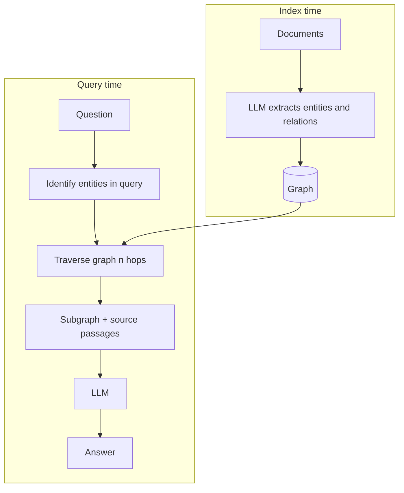
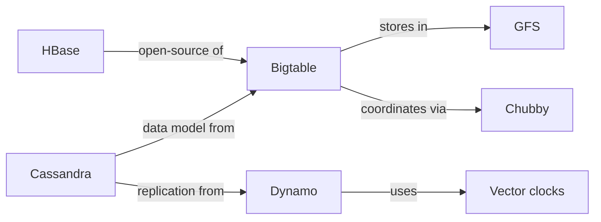

## What it is

Graph RAG extracts entities and the relationships between them at index time, builds a
graph, and retrieves by traversing it rather than by similarity alone.

## The problem it solves

Some questions have no single passage that answers them.

> *Which system combined Bigtable's data model with Dynamo's replication approach?*

The answer is Cassandra. In this project's corpus that fact is stated in two places —
`bigtable.md` says Cassandra borrowed its column-family model, `dynamo.md` says Cassandra
borrowed its replication. Neither sentence contains the full answer.

Similarity search retrieves passages that look like the *question*. It has no mechanism
for "retrieve A, notice A points at B, then retrieve B." Multi-hop questions are not a
tuning problem for dense retrieval — they are outside what it can express.

## How it works

The expensive part runs once, at index time. Query time is a graph walk, which is cheap.

## The graph

Nodes are entities, edges are relations, both extracted by an LLM:

Answering the Cassandra question is now one hop from `Cassandra` in two directions —
a graph operation, not a similarity computation.

**Traversal complexity:** breadth-first to depth *d* is O(V + E) worst case, but bounded
in practice by the hop limit and node degree. Depth 2 from a single entity is typically
tens of nodes.

## The real cost: extraction

Building the graph means an LLM call per chunk — 18 chunks here, thousands in a real
corpus. That is the most expensive index-time operation of any technique on this site, and
it repeats whenever documents change.

It is also the least reliable step. Extraction quality determines everything downstream,
and it is inconsistent: the same entity appears as `Dynamo`, `Amazon Dynamo`, and
`DynamoDB` — the last of which is a *different system*. Without entity resolution the
graph fragments, and a fragmented graph silently loses the very hops it exists to provide.

## Trade-offs

| | Standard RAG | Graph RAG |
|---|---|---|
| Index cost | Embed each chunk | Embed **+ LLM call per chunk** |
| Query cost | 1 LLM call | 1 LLM call + traversal |
| Re-index on change | Cheap | Expensive |
| Multi-hop questions | Cannot | Designed for |
| Single-passage questions | Strong | No better, sometimes worse |
| Main risk | Wrong passage | Bad extraction, silently |

## When to use it

- Genuinely relational corpora — org charts, dependency graphs, citations, case law
- Questions that name relationships: "who reports to", "what depends on", "derived from"
- Stable documents, so extraction cost amortises

## When NOT to use it

- **Corpora without meaningful entity relationships** — narrative prose, support tickets.
  You pay the extraction cost and the graph has nothing useful in it.
- **Frequently changing documents** — re-extraction on every edit is brutal
- **Mostly single-hop questions** — Graph RAG adds no accuracy and considerable cost
- **When you have not measured that multi-hop questions are actually failing** — this is
  the most over-adopted technique in the list

## Real-world

Microsoft's GraphRAG paper popularised the approach and is the reference implementation
worth reading. Its notable extension is *community detection*: clustering the graph and
summarising each cluster, so the system can answer corpus-level questions ("what are the
main themes?") that no individual passage contains.
