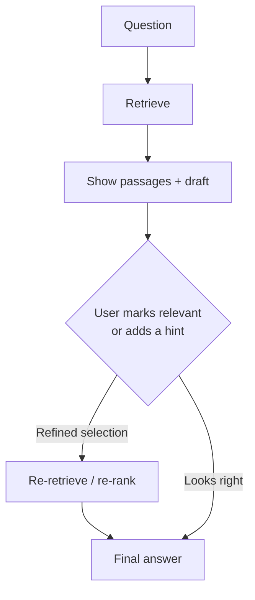

## What it is

Interactive RAG puts a human in the loop. It retrieves, shows you what it found, and lets
you mark which passages are actually relevant — or add a hint — before it writes the final
answer.

## The problem it solves

Every automated technique so far tries to *infer* what you meant. Multi-Pass critiques
itself, Auto RAG classifies the query, Agentic RAG assesses its own progress. All three
are the model guessing at intent, and all three share one blind spot: the model cannot
know a fact it never retrieved is missing.

You often can, instantly. Shown four passages, a domain expert sees in two seconds that
the third one is off-topic and the thing they meant is absent. That judgment is expensive
to synthesise and free to ask for.

## How it works

The pipeline stops midway and waits. That is the point, and it is also what makes this the
first technique that cannot be a single function call.

## What it changes architecturally

Everything before this fits `run(query) -> RAGResult`. Interactive RAG does not: the
pipeline pauses, returns a draft, waits an unbounded amount of time, and resumes with new
input.

That forces real design decisions:

- **State has to live somewhere.** The draft, its retrieved passages, and the query must
  survive between two HTTP requests. That means a session or draft id.
- **The API becomes two-step.** `POST /api/run` returns a draft plus a draft id; a second
  call submits the user's selection.
- **Sessions expire.** Stored drafts need a TTL, or you accumulate state forever.

This is the technique that pushes hardest on the `RAGPipeline` contract, and it is worth
noticing *why*: the interface assumed a run is a function of its input. Human input makes
it a conversation.

## Trade-offs

| | Automated techniques | Interactive RAG |
|---|---|---|
| Latency | Seconds | Human-bounded — seconds to minutes |
| Accuracy ceiling | Model's judgment | Human's judgment |
| Automatable | Yes | No, by design |
| API shape | One call | Two calls + stored state |
| Works unattended | Yes | No |

## The failure mode

**It moves work onto the user, and users will not do it.** Reviewing four passages takes
real attention. In practice most people click straight through, which means you have paid
for a two-step API, session storage, and a more complex UI to get Standard RAG with extra
friction.

The technique earns its keep only where the user is genuinely expert, genuinely invested,
and the answer genuinely matters — a lawyer checking citations, an engineer debugging a
specific incident. Applied to casual queries, it is worse than doing nothing.

## When to use it

- High-stakes answers where being wrong is expensive
- Expert users who can judge relevance faster than any model
- Workflows where the user is already reading source material
- Corpora with ambiguity the system cannot resolve — internal jargon, overloaded terms

## When NOT to use it

- **Casual or high-volume queries** — the interaction cost exceeds the accuracy gain
- **Non-expert users** — they cannot judge relevance, so the feedback is noise
- **Automated pipelines** — there is no human to ask
- **Latency-sensitive UX** — you have introduced an unbounded human-shaped delay

## Real-world

Legal and medical research tools work this way, and it is the correct choice there: the
user is an expert, the stakes justify the friction, and reviewing sources is already part
of the job rather than an extra step the software invented.
