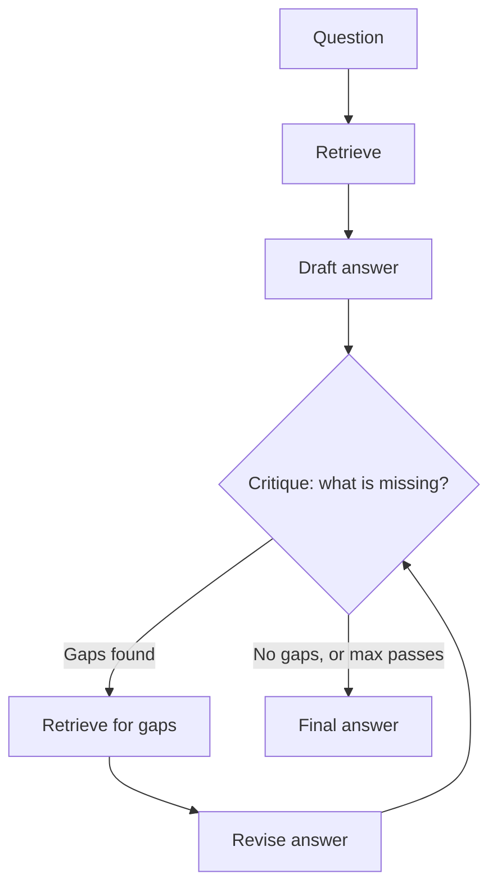

## What it is

Multi-Pass RAG drafts an answer, reads its own draft to find what is missing, retrieves
again to fill those gaps, and answers once more. It trades latency and cost for coverage.

## The problem it solves

Standard RAG retrieves once, using only the question. But the question often does not
contain the words needed to find the answer.

"Compare Dynamo and Bigtable's approaches to consistency" retrieves passages about
consistency. It does not necessarily retrieve Bigtable's *tablet* model or Dynamo's
*quorum* parameters — the specifics you need to actually make the comparison. You cannot
know to search for "quorum" until you have started answering and noticed the gap.

A draft is a much better query than a question, because it contains the vocabulary of the
answer.

## How it works

The loop is: draft → critique → targeted retrieval → revise. Capped at 3 passes.

## Why the cap is not optional

Two independent reasons, and the second is the one people miss.

**Termination.** The critique step asks a model to find flaws in its own output. A model
asked "what is missing?" can almost always find *something*, so the loop has no reliable
natural stopping point. Without a cap it can run indefinitely.

**Cost.** On a paid backend, an uncapped loop is the fastest way to drain a budget. Three
passes is up to five LLM calls — draft, critique, revise, critique, revise. There is no
critique after the final revision: the cap has already been reached, so nothing could act
on its verdict, and a call whose answer must be discarded is a call not worth buying. At
Haiku rates that is roughly $0.01 per query rather than $0.002. On a more expensive model
it is the difference between a demo and a bill.

This is why `max_passes` lives in config next to the spend guardrails, not as a tuning
parameter buried in the pipeline.

## Trade-offs

| | Standard RAG | Multi-Pass RAG |
|---|---|---|
| LLM calls | 1 | 2–5 |
| Retrieval passes | 1 | 1–3 |
| Latency | ~1x | 3–5x |
| Cost | ~1x | 3–6x |
| Coverage on broad questions | Weak | Strong |
| Risk | — | Self-critique can invent gaps and pad the answer |

## The failure mode worth knowing

**The critique step is a model grading itself, and it is not a reliable judge.** It can
report gaps that do not exist, sending retrieval after material that was never needed, and
the revision then dutifully incorporates it. The answer gets longer and less focused while
appearing more thorough.

It can also miss the gap that matters. Nothing guarantees that a model blind to a fact
while drafting becomes aware of it while critiquing — the same blind spot applies to both.

Watch the steps trace: if pass 2 and pass 3 retrieve chunks that never change the answer,
the loop is spending money to feel diligent.

## When to use it

- Broad, multi-part questions — "compare X and Y", "summarise the trade-offs"
- Corpora where relevant material is scattered across documents
- Accuracy matters more than latency, and a 10–20 second answer is acceptable

## When NOT to use it

- **Interactive UIs** — 3–5x latency on top of an already slow generation step is a bad
  experience
- **Simple factual lookups** — extra passes add cost and no coverage
- **Tight budgets on paid models** — this is the single most expensive technique per query
  outside Agentic RAG

## Real-world

This is the shape behind "deep research" features: draft, identify gaps, search again,
revise. Those products can justify the cost because the user explicitly asked for a
thorough answer and expects to wait — the trade only works when the user has opted into it.
