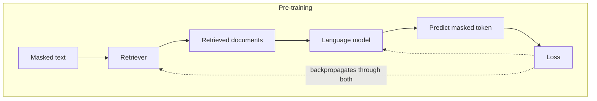

## What it is

REALM (Retrieval-Augmented Language Model pre-training) trains the retriever and the
language model *together*. The retriever learns which passages actually help the model
predict better, rather than which passages look similar to the query.

Guu et al., Google Research, 2020 — [arXiv:2002.08909](https://arxiv.org/abs/2002.08909).

> **This page is documentation only.** REALM cannot run in this project, and the reason is
> the interesting part.

## The problem it solves

Every other technique here shares one assumption: **the retriever is frozen.** It was
trained on some general corpus with a similarity objective, and it never learns whether
the passages it returns actually led to better answers.

That is a real gap. "Similar to the query" and "useful for answering the query" are
correlated, not identical. A passage that restates the question ranks highly and helps not
at all. A passage with the missing fact but different vocabulary ranks lower and is exactly
what was needed.

REALM closes the loop: the retriever's training signal is the *language model's*
performance.

## How it works

The dotted lines are the whole idea. In every other technique on this site, gradient never
flows back into retrieval — the retriever is a fixed function. Here the loss signal reaches
it, so retrieval is *learned*.

## Why it cannot run here

Three hard blockers, and they are structural rather than incidental:

**1. It is a pre-training method, not an inference technique.** REALM is not something you
apply to an existing model. The joint training *is* the method. There is no "run REALM on
your documents" — you would be training a language model from scratch.

**2. The index must be rebuilt during training.** As the retriever's weights update, every
document embedding it produced becomes stale. REALM re-embeds the entire corpus
periodically *mid-training* — the paper uses asynchronous refresh across many workers.
Millions of documents, repeatedly, during a training run.

**3. Cost.** The original work used hundreds of TPU-hours. This project's entire budget is
$5 and a laptop.

## Trade-offs

| | Technique-level RAG (this site) | REALM |
|---|---|---|
| Retriever | Frozen, general-purpose | Learned jointly with the LM |
| Adapts to your corpus | Via prompting or feedback | Via gradients |
| Setup cost | Minutes | Hundreds of TPU-hours |
| Swap the LLM | Change one config value | Retrain |
| Update documents | Re-index in seconds | Re-embed, ideally retrain |
| Feasible for most teams | Yes | No |

## Why it still matters

REALM marks the boundary of what the other eight techniques can do. They are all
*architectural* — they arrange a frozen retriever and a frozen model more cleverly.
REALM changes the components themselves.

Knowing where that boundary sits is practically useful: if your retrieval fails because it
does not understand your domain's vocabulary, no amount of fusion, routing, or graph
traversal fixes the underlying representation. Feedback RAG is the cheap approximation —
learning relevance from usage instead of gradients — and it is the right tool at this
scale.

The lineage also matters. REALM's central idea — that retrieval should be trained, not
assumed — runs through RAG (Lewis et al., 2020), Atlas, and Retro, and into today's
fine-tuned embedding models. When you fine-tune an embedding model on your own
query-document pairs, you are applying REALM's insight at a price you can afford.

## When to use it

Realistically: when you are a research lab with pre-training infrastructure, or when a
frozen retriever provably cannot represent your domain and you have the budget to fix that
properly.

## When NOT to use it

Almost always. The practical descendant — fine-tuning an off-the-shelf embedding model on
your own labelled pairs — captures much of the benefit for a rounding error of the cost.

## Real-world

REALM itself is not deployed in production anywhere public. Its influence is the legacy:
learned retrieval is now standard in research systems, and the commodity version —
domain-fine-tuned embedding models — is something any team can do in an afternoon.
