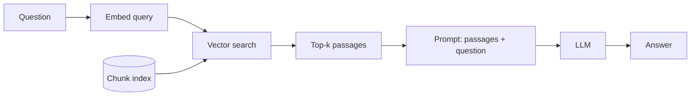

## What it is

Standard RAG is the baseline: embed the question, find the nearest passages by vector
similarity, put them in the prompt, answer from them. One retrieval, one LLM call, no
loops.

Every other technique on this site is a response to a specific way this shape fails.
Understanding it precisely is what makes the other eight legible.

## How it works

Three stages. The index is built ahead of time — documents are split into chunks, each
chunk embedded once and stored. At query time only the question is embedded.

## Why it works at all

An embedding maps text to a point in space positioned so that *semantically* similar text
lands nearby. That is why "how does Dynamo handle conflicting writes?" retrieves a passage
about vector clocks despite sharing almost no words with it.

Keyword search cannot do that. This is the single capability that makes dense retrieval
worth the machinery — and, as Fusion RAG shows, it comes with a matching blind spot.

## Trade-offs

| | Standard RAG |
|---|---|
| LLM calls | 1 |
| Retrieval passes | 1 |
| Latency | Lowest of any technique here |
| Cost | Lowest |
| Failure mode | Retrieves the wrong passage and cannot notice |
| Best at | Direct questions answerable from one passage |
| Worst at | Exact terms, multi-hop questions, ambiguous queries |

## The core weakness

**It cannot tell whether retrieval succeeded.** The pipeline retrieves once and answers
from whatever came back. If the right passage ranked fifth and `top_k` is 4, the model
never sees the fact, and it will still produce a confident, fluent answer from the four
passages it did get.

There is no signal for this in the output. The answer looks identical whether retrieval
worked or not — which is why the playground shows you the retrieved passages rather than
just the answer.

## When to use it

- The corpus is small and topically clean
- Questions map to a single passage
- Latency or cost is the binding constraint
- You need a baseline to measure other techniques against

## When NOT to use it

- **Questions containing exact identifiers** — error codes, function names, version
  numbers. Embeddings blur these. Use Fusion RAG.
- **Questions spanning documents** — "which system combined X's data model with Y's
  replication?" needs facts from two places. Use Graph RAG.
- **Open-ended research questions** — one retrieval cannot cover a broad question.
  Use Multi-Pass or Agentic RAG.

## Real-world

This is what most "chat with your docs" products ship first, and for a large fraction of
support-document and internal-wiki use cases it is genuinely enough. The techniques that
follow exist because the remaining fraction is where the hard questions live.
